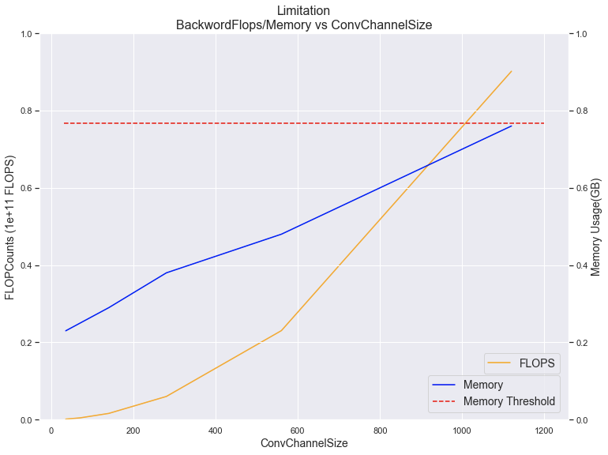

# OnDeviceTrain
Train Reversible Neural Network on mobile devices

# Our goal:
1. Implement and optimize neural network training on device(with respect to memory, FLOP, energy etc.)
2. One-shot learning on mobile device

# Why Train on Device:
1. Customized Models for each user
2. Data not leaving device(good for privacy)
3. Saves Money for communicating data over air

Here is a very good article about why on-device training will be important:
https://machinethink.net/blog/training-on-device/

# Constraints of On-Device Training
1. Computational Power (FLOP)
2. Memory Comsumption
3. Energy Comsumption (Battery) - we might want to train only when the device is charging

# Papers for reference
1. The Reversible Residual Network: Backpropagation Without Storing Activations:
https://arxiv.org/abs/1707.04585

2. i-RevNet: Deep Invertible Networks
https://arxiv.org/abs/1802.07088

# Useful Resources
1. The library deeplearning4j we will be using:
https://deeplearning4j.org/docs/latest/deeplearning4j-android

2. PyTorch code for i-revnet:
https://github.com/jhjacobsen/pytorch-i-revnet

3. Tensorflow code for revnet:
https://github.com/renmengye/revnet-public
 
# FLOPS/Memory limitation graph

- This is the limitation graph. This graph is the normal training process, not our irevNet implementation. Basically we keep increasing the conv channel size on an mnist dataset and observe when the training will explode. From this graph we can see that the memory’s limit is 0.768GB, which is fixed  by Android 6.0 640dpi.